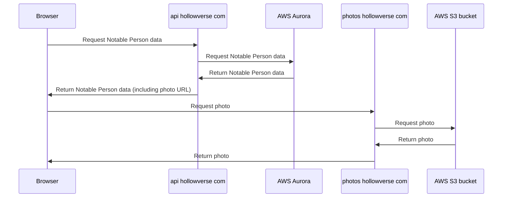
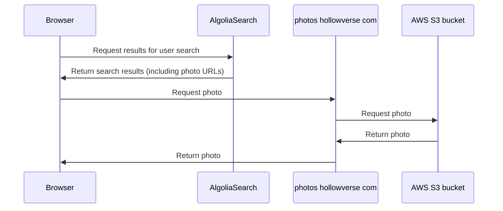
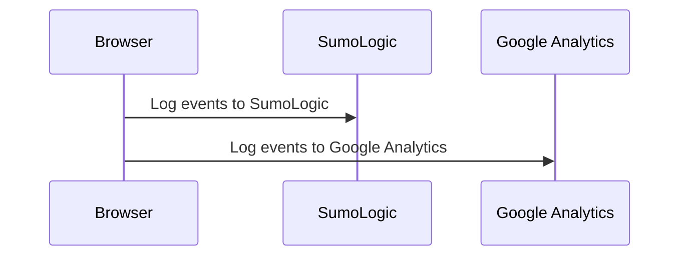

# After Downloading `index.html`

This documents what happens after the user loads `index.html` of `hollowverse.com`

## Notable Person page (e.g. /Tom_Hanks)

## Search page (/search)

## Any Hollowverse page

All of Hollowverse pages log events to SumoLogic and Google Analytics.

SumoLogic logging is used for short term debugging and monitoring.

Google Analytics logging is used for long-term analytics purposes.
