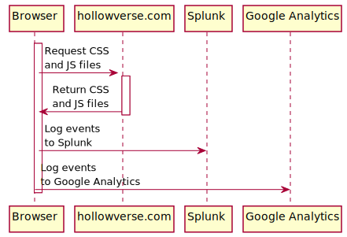
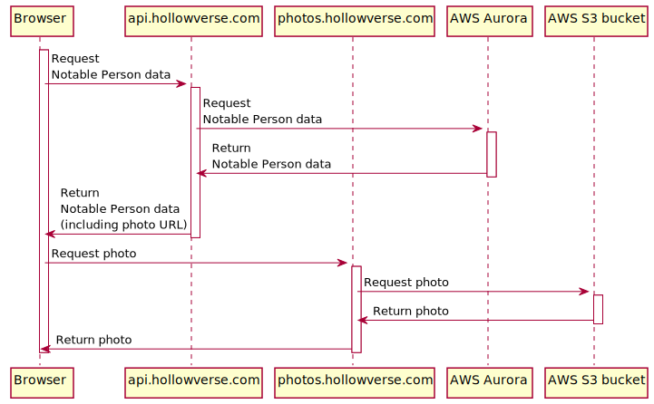
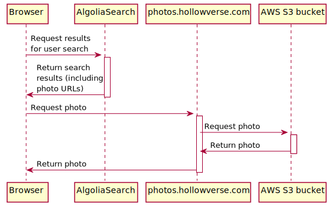

# After Downloading `index.html`

This documents what happens after the user loads `index.html` of `hollowverse.com`

## Any Hollowverse page

After the browser downloads `index.html` for any page the first thing the browser will do is request the CSS and JS files from [hollowverse.com CloudFront distribution](./hollowverseComCloudFront.md).

Most hollowverse.com pages also send logging and analytics events to Splunk and Google Analytics.

Splunk logging is used for short term debugging and monitoring.

Google Analytics logging is used for long-term analytics purposes.

## Notable Person page (e.g. `/Tom_Hanks`)

hollowverse.com data is retrievable from `api.hollowverse.com`, an AWS Lambda that executes [`serveApi`](https://github.com/hollowverse/api/blob/master/src/serveApi.ts).

`api.hollowverse.com` is queryable using GraphQL and it uses [AWS Aurora](https://github.com/hollowverse/infrastructure/blob/b62b70cc354e77a35c2aef4104db66f86a619b00/db.tf#L65), a managed relational MySQL-compatible database service.

After the browser receives the response from `api.hollowverse.com`, it will know where to find the photo of the Notable Person, so it requests the photo from [`photos.hollowverse.com`](https://github.com/hollowverse/infrastructure/blob/b62b70cc354e77a35c2aef4104db66f86a619b00/domains.tf#L6) which is backed by [an AWS S3 bucket](https://github.com/hollowverse/infrastructure/blob/b62b70cc354e77a35c2aef4104db66f86a619b00/photos.tf#L15).

Both [`api.hollowverse.com`](https://github.com/hollowverse/api/blob/14f31173a56c2b026cc3d4a14c5d4d6db7f9b33b/serverless.yml#L91) and [`photos.hollowverse.com`](https://github.com/hollowverse/infrastructure/blob/b62b70cc354e77a35c2aef4104db66f86a619b00/photos.tf#L61) use CloudFront for caching.

## Search page (`/search`)

The search page works in a very similar manner to the Notable Person page with the exception that the data is retrieved from AlgoliaSearch instead of `api.hollowverse.com`.
