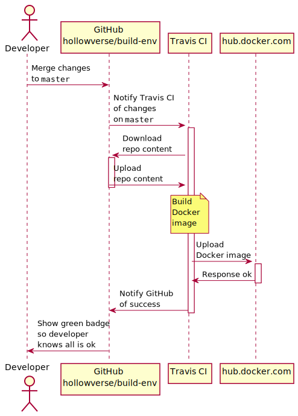

# Deploying

Most Hollowverse repos are built by Travis CI in Docker containers, which are based on images which get downloaded from [hub.docker.com](https://hub.docker.com/) at build time.

## Deploying Docker images

The Docker images which are used by Travis CI have their own deployment pipeline.

[hollowverse/build-env](https://github.com/hollowverse/build-env) contains the Docker files which are used to generate our build environment images. These images get uploaded to hub.docker.com when we merge changes to the `master` branch of `hollowverse/build-env`, as the diagram below shows:

## Deploying hollowverse.com
