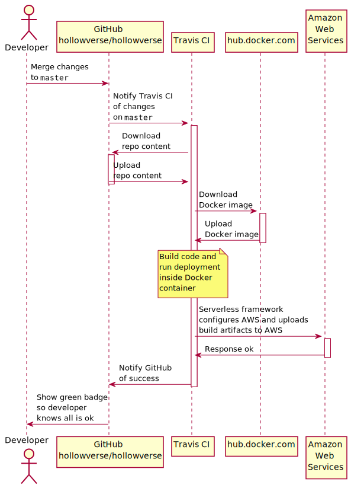

# Deploying

Most Hollowverse repos are built by Travis CI in Docker containers, which are based on images which get downloaded from [hub.docker.com](https://hub.docker.com/) at build time.

## Deploying Docker images

The Docker images which are used by Travis CI have their own deployment pipeline.

[hollowverse/build-env](https://github.com/hollowverse/build-env) contains the Docker files which are used to generate our build environment images. These images get uploaded to hub.docker.com when we merge changes to the `master` branch of `hollowverse/build-env`, as the diagram below shows:

<p align="center">

</p>

### How the Docker images are configured

Our Docker images expect that the code will be mounted at `/repo` inside the container, which allows the container access to the source code. When Docker starts a container, it executes the [`CMD` instruction](https://github.com/hollowverse/build-env/blob/2db31a84529b223dc84802104d301c82735ebff3/Dockerfile#L20), which are usually:

```bash
yarn && yarn deploy
```

The Docker images closely matches the target deployment environment. For example, if we are targeting Lambda with Node.js 8, the image will contain Node.js 8 and all the native runtime libraries that are expected to be available in Lambda execution environment. Additionally, the images contain some binaries and tools that are required to build some Node.js packages but are not required at runtime.

Because the Lambda execution environment is pretty restricted, we try to ensure that no extraneous dependencies are available at build time, to avoid any possible runtime errors.

## Deploying an AWS Lambda function

The services that power hollowverse.com are mostly AWS Lambda functions.

`hollowverse/hollowverse`, `hollowverse/api`, and `hollowverse/route-request` are all AWS Lambda functions and follow a similar deployment pipeline. That pipeline is illustrated and explained below:

<p align="center">

</p>

Hollowverse AWS Lambda functions utilize [Serverless framework](https://github.com/serverless/serverless). Packaging and deployments are handled by Serverless.

Serverless will run inside the Docker container in Travis CI. It will read `serverless.yml` and build the specified functions.

Serverless will upload the build artifacts to AWS and create a [CloudFormation](https://aws.amazon.com/cloudformation/) stack. CloudFormation is an AWS service that allows managing a group of resources from different AWS services. This group of services is called a stack. For example, a stack may define a CloudFront distribution, a Route 53 record, 2 Lambda functions, an API Gateway API and an S3 bucket with corresponding IAM roles and permissions to allow interactions between these resources. These resources are defined based on the contents of `serverless.yml`.

If all goes well, AWS will report success to Serverless, the build will succeed, and things will be green.
