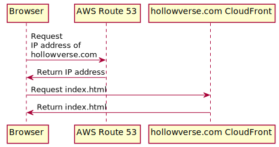

# Serving `index.html`

An initial user request to Hollowverse is handled as illustrated in the diagram above.

Hollowverse uses [AWS Route 53 for DNS management](https://github.com/hollowverse/infrastructure/blob/b62b70cc354e77a35c2aef4104db66f86a619b00/domains.tf#L2).

`hollowverse.com` points to [a CloudFront distribution](https://github.com/hollowverse/route-request/blob/4a819699a80e36c1e67de2b92a27eb35c11e0f9a/serverless.yml#L69) that is [documented here](./hollowverseComCloudFront.md).
