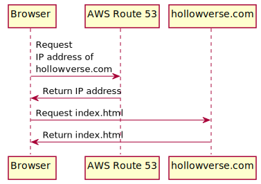

# Serving `index.html`

An initial user request to Hollowverse is handled as illustrated in the diagram above.

Hollowverse uses AWS Route 53 for DNS management.

`hollowverse.com` points to a CloudFront distribution that is [documented here](./hollowverseComCloudFront.md).
