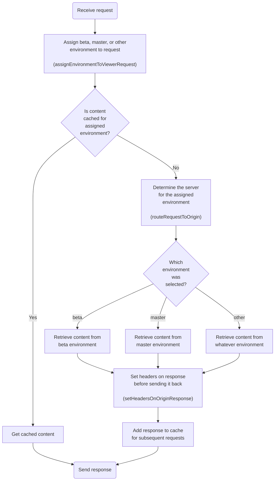

# hollowverse.com CloudFront distribution

When CloudFront receives the request for the page, it executes the Lambda@Edge assigned to the `viewer-request` stage. This is [`assignEnvironmentToViewerRequest`](https://github.com/hollowverse/route-request/blob/master/src/assignEnvironmentToViewerRequest.ts).

`assignEnvironmentToViewerRequest` modifies the incoming user request and returns the modifies request [TK modifies the request based on what? Why does it modify the request?].

Then CloudFront looks for a cached copy of the page that matches exactly the headers of the request after the request has been modified by `assignEnvironmentToViewerRequest`.

If a cached response is available for the resulting cache key, CloudFront returns that copy and the viewer request does not hit the origin server.

If no cached response is available, CloudFront will execute the Lambda@Edge assigned to the `origin-request` stage, which is [`routeRequestToOrigin`](https://github.com/hollowverse/route-request/blob/master/src/routeRequestToOrigin.ts).

`routeRequestToOrigin` reads the `x-hollowverse-requested-environment` header and modifies the request so that it is directed to the corresponding environment.

After retrieving the content from the corresponding environment, CloudFront executes the Lambda@Edge assigned to the `origin-response` stage. This is [`setHeadersOnOriginResponse`](https://github.com/hollowverse/route-request/blob/master/src/setHeadersOnOriginResponse.ts).

`setHeadersOnOriginResponse`, as the name implies, sets some headers on the origin response, including `Set-Cookie` which allows the user to stay on the same environment for the lifetime of the cookie.

CloudFront takes the response _after_ it's modified by `setHeadersOnOriginResponse` and stores it in the edge cache so it's available for subsequent requests.
