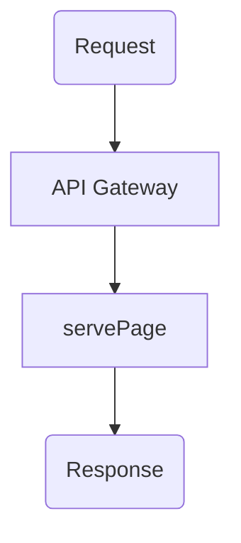

# Origin Server

```mermaid
graph TD
  request(Request) --> apiGateway[API Gateway]
  apiGateway --> servePage
  servePage --> response(Response)
```

An "environment" is an API Gateway API which proxies all requests to a regular Lambda function that serves the static files (index.html, scripts, stylesheets...).
