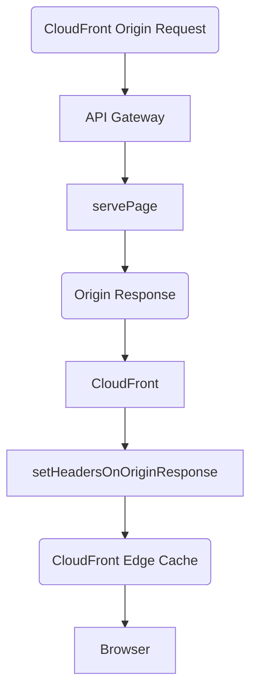
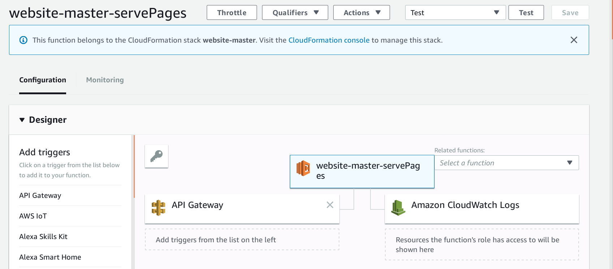

# Origin Server



Lambda do not have URLs. We cannot directly call a Lambda by visiting a URL in the browser. However, Lambdas can be launched in response to triggers.

A trigger can be:

* a specific point in time set according to a schedule (like how [`track-performance`](https://github.com/hollowverse/track-performance) is run everyday).
* a new file being added to S3 (like how [`process-image`](https://github.com/hollowverse/process-image) crops new NP images)
* an HTTP request incoming to API Gateway

So API Gateway is a way to associate a URL with a Lambda. Each environment in API Gateway has a URL like this:

```
https://nwfww37l0c.execute-api.us-east-1.amazonaws.com/master/Tom_Hanks
|                                                    |       |
|---------------- API base domain -------------------|-Stage-|
```

This is the API Gateway URL for the "API" wrapping our Lambdas.

It is worth noting that an API in API Gateway is not limited to Lambda, but for us, all that the API does is proxying requests the Lambda.

URL paths in API Gateway can be mapped to different Lambda functions:

* `/log` is mapped to the function [`serveLogEndpoint`](https://github.com/hollowverse/hollowverse/blob/fa81a9ddb39fa908f9eb8fe4524e46db486134fd/src/serveLogEndpoint.ts).
* Any other path (i.e. `/{proxy+}`) is mapped the function [`servePages`](https://github.com/hollowverse/hollowverse/blob/fa81a9ddb39fa908f9eb8fe4524e46db486134fd/src/servePages.ts).



The associations are defined [in `serverless.yml`](https://github.com/hollowverse/hollowverse/blob/fa81a9ddb39fa908f9eb8fe4524e46db486134fd/serverless.yml#L30). [Serverless](https://serverless.com/) takes care of creating the API and the Lambda functions and integrating the functions with the API.

Visiting a path like `/Tom_Hanks` will trigger an HTTP event in Lambda causing the associated function to execute. The function will respond with the response for `/Tom_Hanks`.

The Lambda@Edge [`routeRequestToOrigin`](https://github.com/hollowverse/route-request/blob/master/src/routeRequestToOrigin.ts) routes environments to the API Gateway URLs (for example `beta` is routed to https://w5ch1jftqc.execute-api.us-east-1.amazonaws.com/beta and `master` is routed to https://nwfww37l0c.execute-api.us-east-1.amazonaws.com/master).
This process is described in detail in [hollowverse.com CloudFront distribution](../hollowverseComCloudFront/hollowverseComCloudFront.md)
