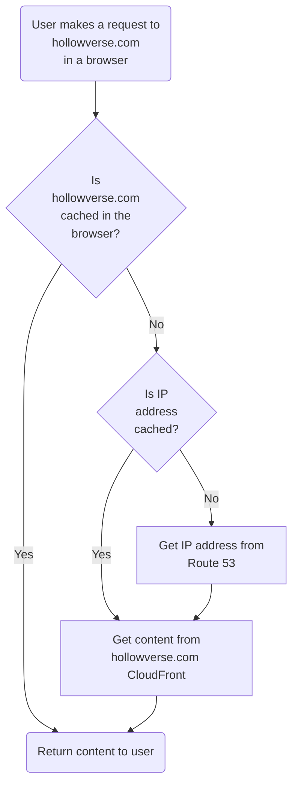

# User Request

A user request to Hollowverse is handled as illustrated in this diagram.

Hollowverse uses [AWS Route 53](./TK-link-to-configurations) for DNS management.

`hollowverse.com` points to a [CloudFront distribution](../hollowverseComCloudFront.md).
